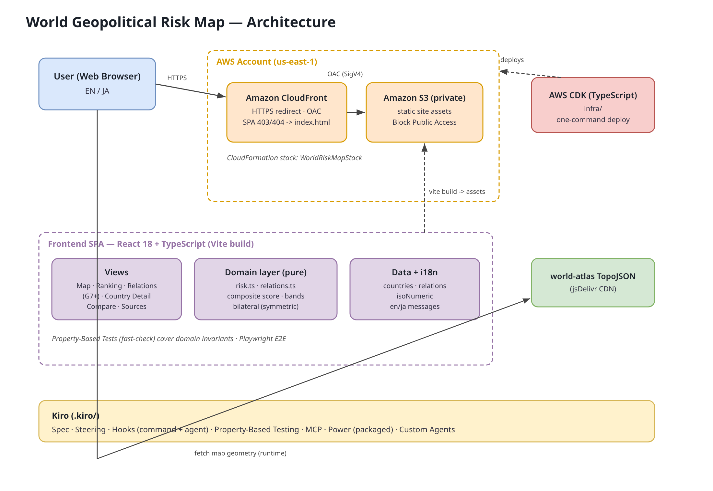

# 🌐 World Geopolitical Risk Map

**English** | [日本語](README.ja.md)

A frontend-only web app that visualizes **geopolitical risk** for countries and
country pairs as a composite score based on public quantitative indices.
Built as the final exam (backup project) for the **Kiro University Challenge 2026**,
demonstrating the 7 core Kiro features.

🌍 **Live site:** https://d1phbaff9oackz.cloudfront.net

## Overview

- Choroplese world map coloring each country by risk
- Risk ranking (search & sort)
- Per-country risk breakdown (5 components)
- Bilateral geopolitical risk (symmetric score) comparison
- Bilateral relations overlay on the world map (ally / neutral / rival, from a chosen country)
- Clear sources and disclaimer for every indicator
- **Internationalized UI (English [default] / Japanese toggle, persisted in `localStorage`)**

## Architecture



The editable diagram is [`docs/architecture.drawio`](docs/architecture.drawio) (open with draw.io / diagrams.net).
A PNG (`docs/architecture.png`) and vector (`docs/architecture.svg`) are included.

- Users (browser) fetch the static site from a **private S3** bucket via **CloudFront** (HTTPS, OAC)
- The frontend is a **React + TypeScript (Vite)** SPA, split into view / pure domain / data+i18n layers
- Map geometry is fetched at runtime from **world-atlas TopoJSON (CDN)**
- Infrastructure is codified with **AWS CDK (TypeScript)** (`infra/`) and deployed as a CloudFormation stack
- Development is driven by Kiro features (`.kiro/`: Spec / Steering / Hooks / PBT / MCP / Power / Custom Agent)

## How risk is quantified

The composite risk score `R` (0–100, higher = higher risk) is the weighted average
of five components normalized to 0–100 (weights sum to 1.0):

| Component | Weight | Reference index |
|---|---|---|
| Conflict & violence (conflict) | 0.30 | Global Peace Index / Fragile States Index (security) |
| Governance / political stability (governance) | 0.25 | WGI Political Stability / FSI (political) |
| Economic fragility (economic) | 0.20 | FSI (economic) |
| External relations / geopolitical tension (external) | 0.15 | Geopolitical Risk Index (Caldara & Iacoviello) |
| Social cohesion (social) | 0.10 | FSI (social) |

Risk categories: Low 0–24 / Moderate 25–49 / High 50–74 / Severe 75–100

### Sources
- Fragile States Index — Fund for Peace: https://fragilestatesindex.org/
- Global Peace Index — Institute for Economics & Peace
- Geopolitical Risk (GPR) Index — Caldara & Iacoviello (Federal Reserve): https://www.matteoiacoviello.com/gpr.htm
- Worldwide Governance Indicators — World Bank

> **Disclaimer:** Scores on this site are synthetic sample values for education and
> visualization, and do not exactly reproduce the official values of the indices above.
> Relative ordering is inspired by public rankings.

## Tech stack

- TypeScript (strict) / React 18 / Vite
- Map: react-simple-maps + d3-scale / d3-geo (world-atlas TopoJSON)
- Tests: Vitest + Testing Library + **fast-check (Property-Based Testing)** + **Playwright (E2E)**
- Lint/Format: ESLint + Prettier

## Internationalization (i18n)

The UI supports **English (default) / Japanese** via a switcher in the header. The
chosen language is saved to `localStorage` and reflected in `<html lang>`. Implemented
in `src/i18n/` (`messages.ts` dictionary + `I18nContext` provider / `useI18n`). Country
names are shown per language.

## Development

```bash
npm install
npm run dev        # dev server
npm run test       # unit + Property-Based Test (watch)
npm run test:run   # single run
npm run lint       # ESLint + tsc --noEmit
npm run build      # production build
npm run e2e        # Playwright E2E (requires: npx playwright install chromium)
```

## Deployment (AWS — S3 + CloudFront, CDK)

Production is deployed with **AWS CDK (TypeScript)** to an S3 + CloudFront setup
(see `infra/README.md`).

```bash
npm run build            # produces dist/ (base '/')
cd infra && npm install
npx cdk deploy --require-approval never
```

- Private S3 bucket + CloudFront (OAC) + enforced HTTPS + SPA fallback
- Live URL: https://d1phbaff9oackz.cloudfront.net

> Optional: `GITHUB_PAGES=true npm run build` sets `base` to `/kiro-worldriskmap/`,
> enabling publishing to GitHub Pages via `.github/workflows/deploy.yml` (Pages must be enabled).

## Kiro University — the 7 lessons

| Lesson | Feature | Where in this repo |
|---|---|---|
| 1 | Spec-driven development | `.kiro/specs/geopolitical-risk-map/` (EARS requirements/design/tasks) |
| 2 | Steering | `.kiro/steering/` (requirements, conventions, domain knowledge, MCP usage) |
| 3 | Hooks | `.kiro/hooks/hooks.json` (**command**: lint / domain tests on save; **agent**: invariant review / Stop self-check) |
| 4 | Property-Based Testing | `src/domain/risk.property.test.ts`, `src/domain/relations.property.test.ts` (fast-check) |
| 5 | MCP | `.kiro/settings/mcp.json` (fetch / aws-docs) + usage workflow `.kiro/steering/mcp-usage.md` |
| 6 | Powers | `.kiro/powers/geopolitical-risk/` (**distributable package**: manifest + power + steering + skill + README) |
| 7 | Custom Agents | `.kiro/agents/` (`risk-data-reviewer`, `submission-auditor`) |

### Quality process
- Unit tests + Property-Based Tests for the domain layer (**29 tests**)
- Playwright E2E + screenshot-based UI verification (**11 tests**)
- Multiple self-reviews → GitHub Issues (#1–#15) → autonomously fixed & closed

## Project structure

```
.kiro/            # Kiro University lesson artifacts
docs/             # architecture diagram (drawio / svg / png)
infra/            # AWS CDK (TypeScript) IaC
src/
├── domain/       # React-free pure logic (risk, relations) + tests
├── data/         # country data (with sources) / ISO map / relations
├── components/   # map, legend, bars, badges
├── views/        # map / ranking / relations / country detail / compare / sources
├── i18n/         # messages (en/ja) + language context
└── App.tsx
e2e/              # Playwright E2E
```
